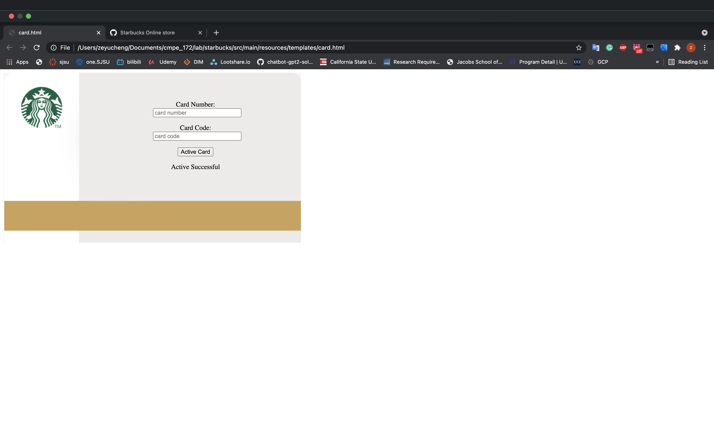

Week 1 journal - Zeyu Cheng

this week I work on the Cards REST API and delete specific card function and I worked on the model, repository, controller. Also I finished the Add Card UI as a html file. The challenge is the html file. this is the first time I did a html file. it takes time on learning it. Next week, I will continue work the the html file and connect it to Cards Rest API.

