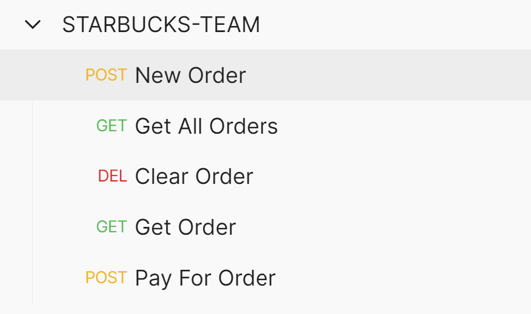

# Week 1 Journal: Brielle Purnell

## What I Worked on This Week
My goal is to work on the Orders REST API part of the project. I will aim to create a Starbucks Order Class, Controller, and Repository. The REST API is as follows:  


```
POST    /order/register/{regid}
        Create a new order. Set order as "active" for register.

        Request:

	    {
	      "Drink": "Latte",
	      "Milk":  "Whole",
	      "Size":  "Grande"
	    }         

	    Response:

		{
		  "Drink": "Latte",
		  "Milk": "Whole",
		  "Size": "Grande",
		  "Total": 2.413125,
		  "Status": "Ready for Payment."
		}	    

GET     /order/register/{regid}
        Request the current state of the "active" Order.

		{
		  "Drink": "Latte",
		  "Milk": "Whole",
		  "Size": "Grande",
		  "Total": 2.413125,
		  "Status": "Ready for Payment."
		}

DELETE  /order/register/{regid}
        Clear the "active" Order.

		{
		  "Status": "Active Order Cleared!"
		}

POST    /order/register/{regid}/pay/{cardnum}
        Process payment for the "active" Order. 

        Response: (with updated card balance)

		{
		  "CardNumber": "627131848",
		  "CardCode": "547",
		  "Balance": 15.17375,
		  "Activated": true,
		  "Status": ""
		}

GET     /orders
        Get a list of all active orders (for all registers)

		{
		  "5012349": {
		    "Drink": "Latte",
		    "Milk": "Whole",
		    "Size": "Grande",
		    "Total": 4.82625,
		    "Status": "Paid with Card: 627131848 Balance: $15.17."
		  }
		}

DELETE 	/orders
		Delete all Orders (Use for Unit Testing Teardown)

		{
		  "Status": "All Orders Cleared!"
		}
```  

I was able to get the basic requests working and persisting. For the future I want to implement Environment variables for regid and cardnum.  


## Commit Link
https://github.com/nguyensjsu/sp21-172-debuggers/commit/278aaca95736b159f99f77275235fad17a18bfb5
