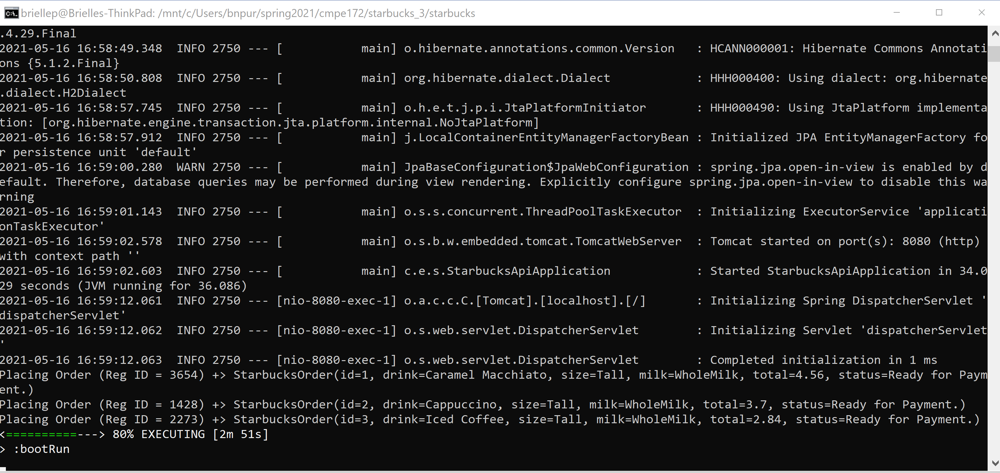
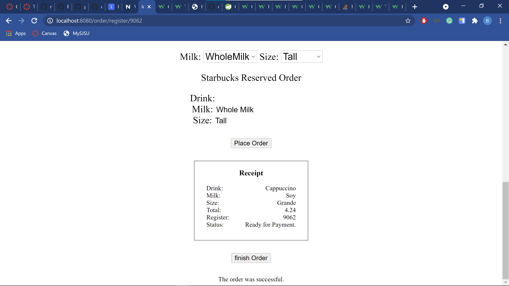
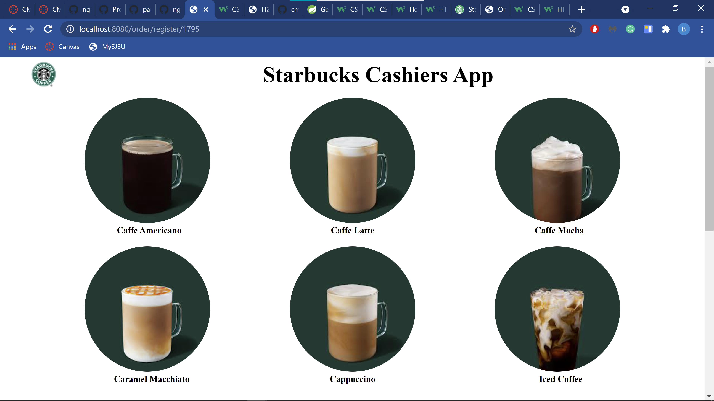

# Week 5 Journal: Brielle Purnell

This week my API was added to the main working code. I worked on the Cashier's App view and controller. 

## Fixed Console Output
The first thing I did this week was fix the console output for creating an order.  

Before, it did not include the id, total, or status of the order. I did this by rearranging a few lines of code.

## Created the Receipt
I created the Receipt portion of the Cashier's App.

I added all of the order's details as model attributes and grabbed them using th:text attributes to display them on the UI. I also added a double lined border around the receipt for a more professional look.

## Updating the Drink Part and Heading of the UI
The next task I moved on to was the drink selection part of the user interface. 

Before, these images were squares and closer together, and the text was not bolded. I transformed the images into circles for an aesthetic closer to the Starbucks company. I bolded the hyperlinked text. I also added padding to the bottoms of the text in order to make it easier to read and determine which text belongs to which image. Furthermore, I reduced the original size of the Starbucks logo from 225x225 pixels to 45x45 pixels and moved it up to the upper left. Before the large logo was in the middle of the UI under the Cashier's App header. Now with the logo placed to the left of the header, that part of the UI conveys a more standard nav-bar feeling. I also fixed the small typo from "Cashiers" to "Cashier's". 

## Challenges
I tried updating the look of the form that is created from selecting the drink, milk, and size. I ran into trouble after I tried to make them labels instead of inputs because placing the order submitted a form created from the inputs. 
  

